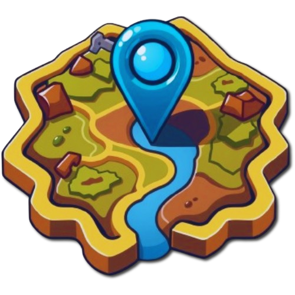

<a id="readme-top"></a>

<br />
<div align="center">
  <a href="https://github.com/IgrWrz21/FindAndSearch">
    
  </a>

<h3 align="center">FindAndSearchGame</h3>

  <p align="center">
    This project is a game called FindAndSearchGame that can be used for playing scavenger hunt games. 
    <br />
    <a href="https://github.com/IgrWrz21/FindAndSearch"><strong>Explore the docs »</strong></a>
    <br />
    <br />
    <a href="https://igrwrz21.github.io/FindAndSearch/">View Demo</a>
    ·
    <a href="https://github.com/IgrWrz21/FindAndSearch/issues/new?labels=bug&template=bug-report---.md">Report Bug</a>
    ·
    <a href="https://github.com/IgrWrz21/FindAndSearch/issues/new?labels=enhancement&template=feature-request---.md">Request Feature</a>
  </p>
</div>

<!-- TABLE OF CONTENTS -->
<details>
  <summary>Table of Contents</summary>
  <ol>
    <li>
      <a href="#about-the-project">About The Project</a>
      <ul>
        <li><a href="#built-with">Built With</a></li>
      </ul>
    </li>
    <li>
      <a href="#getting-started">Getting Started</a>
      <ul>
        <li><a href="#prerequisites">Prerequisites</a></li>
        <li><a href="#installation">Installation</a></li>
        <li><a href="#getting-firebase-and-google-maps-api-key">Getting Firebase and Google Maps API Key</a></li>
        <li><a href="#setting-up-env-file-and-api-keys">Setting up .env file and API Keys</a></li>
      </ul>
    </li>
    <li><a href="#usage">Usage</a></li>
    <li><a href="#roadmap">Roadmap</a></li>
    
  </ol>
</details>

<!-- ABOUT THE PROJECT -->

## About The Project

<div align="center">

</div>
<p align="right">(<a href="#readme-top">back to top</a>)</p>

### Built With

- [![HTML5][HTML5]][HTML5-url]
- [![CSS][CSS]][CSS-url]
- [![TailwindCSS][TailwindCSS]][TailwindCSS-url]
- [![Firebase][Firebase]][Firebase-url]
- [![React][React.js]][React-url]
- [![Redux][Redux]][Redux-url]
- [![React Router][React-router]][React-router-url]
- [![MUI][MUI]][MUI-url]
- [![Google Maps][Google-maps]][Google-maps-url]

<p align="right">(<a href="#readme-top">back to top</a>)</p>

<!-- GETTING STARTED -->

## Getting Started

To run this project locally, follow these steps:

### Prerequisites

This is an example of how to list things you need to use the software and how to install them.

- npm

  ```sh
  npm install npm@latest -g
  ```

### Installation

1. Clone the repository by running the following command in your terminal:

```
git clone https://github.com/IgrWrz21/FindAndSearch.git
```

2. Navigate to the project directory:

```
cd FindAndSearch
```

3. Install the required dependencies by running:

```
npm install
```

4. Start the development server by running:

```
npm start
```

5. Open your web browser and visit `http://localhost:3000` to see the application running.

That's it! You can now explore and use the FindAndSearchGame locally on your machine.

<p align="right">(<a href="#readme-top">back to top</a>)</p>

## Getting Firebase and Google Maps API Key

To use Firebase and Google Maps in your project, you will need to obtain API keys for both services. Follow the instructions below to get your API keys:

### Firebase API Key

1. Go to the [Firebase Console](https://console.firebase.google.com/) and sign in with your Google account.
2. Click on "Add project" or select an existing project.
3. Once inside your project, click on the gear icon (settings) next to "Project Overview" in the left sidebar.
4. Select "Project settings" from the dropdown menu.
5. Scroll down to the "Your apps" section and click on the "Web" platform (</>).
6. Register your app by providing a nickname and optional app ID.
7. After registering your app, you will see a configuration object. Copy the `apiKey` value from this object.

### Google Maps API Key

1. Go to the [Google Cloud Console](https://console.cloud.google.com/) and sign in with your Google account.
2. Click on the project dropdown and select or create the project you want to use with Google Maps.
3. In the left sidebar, click on "APIs & Services" and then "Credentials".
4. Click on the "Create credentials" button and select "API key" from the dropdown menu.
5. Copy the generated API key.

Once you have obtained both the Firebase API key and the Google Maps API key, you can use them in your project to access the respective services.

<strong>Remember to keep your API keys secure and avoid sharing them publicly.</strong>

## Setting up .env file and API Keys

To set up your .env file and add your API keys, follow these steps:

1. Create a new file in the root directory of your project called `.env`.

2. Open the `.env` file in a text editor.

3. Add the following lines to the `.env` file:

```
VITE_FIREBASE_API_KEY=YOUR_FIREBASE_API_KEY
VITE_GOOGLE_MAPS_API_KEY=YOUR_GOOGLE_MAPS_API_KEY
```

Replace `YOUR_FIREBASE_API_KEY` with your actual Firebase API key and `YOUR_GOOGLE_MAPS_API_KEY` with your actual Google Maps API key.

4. Save the `.env` file.

By adding the API keys to the `.env` file, you can securely store sensitive information without exposing it in your codebase.

Remember to keep your `.env` file private and not share it publicly.

That's it! You have successfully set up your `.env` file and added your API keys.

<p align="right">(<a href="#readme-top">back to top</a>)</p>

<!-- USAGE EXAMPLES -->

## Usage

To use the FindAndSearchGame, follow these steps:

1. **Create a Game**:

   - Set up a unique ID for the game.
   - Create a list of questions. Each question should contain:
     - Question text.
     - Correct answer for the question.
     - At least one marked area on Google Maps.
   - You can search for a place or find it directly on Google Maps. After selecting the area, you can add the question.
   - The map will be displayed for the user in the exact view as while adding questions. For example, if the user selects an area in Warsaw and then moves the map to Berlin, the selected area will be in Warsaw, but the user will first see Berlin. The zoom level is also copied.
   - After adding all the questions you want, you can finalize and add the game.

2. **Find a Game**:
   - To find a game, type the unique ID of the game into the input field.
   - If the game is found, a countdown timer will start.
   - Questions will be displayed in random order.
   - After correctly answering a question, the map with the marked area will be displayed.
   - You can move through the questions until the last question.

### Additional Information:

- Answers are hashed to ensure that users cannot see the correct answers in developer tools.
- Map coordinates are fetched only if the user's answer is correct.

<p align="right">(<a href="#readme-top">back to top</a>)</p>

<!-- ROADMAP -->

## Roadmap

- [x] Mark area via google map drawing manager
- [x] Toastify user after creating or serching a game
- [ ] Create Register and Login user.
  - [ ] Connecting autechions to Firebase
  - [ ] Display each user their created games
  - [ ] Edit or Delete Created Games
    - [ ] Allow users to edit questions and marked areas in their created games
    - [ ] Enable users to delete their created games

<p align="right">(<a href="#readme-top">back to top</a>)</p>

[HTML5]: https://img.shields.io/badge/HTML5-E34F26?style=for-the-badge&logo=html5&logoColor=white
[HTML5-url]: https://developer.mozilla.org/en-US/docs/Web/Guide/HTML/HTML5
[CSS]: https://img.shields.io/badge/CSS-1572B6?style=for-the-badge&logo=css3&logoColor=white
[CSS-url]: https://developer.mozilla.org/en-US/docs/Web/CSS
[TailwindCSS]: https://img.shields.io/badge/Tailwind_CSS-38B2AC?style=for-the-badge&logo=tailwind-css&logoColor=white
[TailwindCSS-url]: https://tailwindcss.com/
[Firebase]: https://img.shields.io/badge/Firebase-FFCA28?style=for-the-badge&logo=firebase&logoColor=white
[Firebase-url]: https://firebase.google.com/
[React.js]: https://img.shields.io/badge/React-20232A?style=for-the-badge&logo=react&logoColor=61DAFB
[React-url]: https://reactjs.org/
[Google-maps]: https://img.shields.io/badge/Google_Maps-4285F4?style=for-the-badge&logo=google-maps&logoColor=white
[Google-maps-url]: https://developers.google.com/maps/documentation?hl=en
[Redux]: https://img.shields.io/badge/Redux-764ABC?style=for-the-badge&logo=redux&logoColor=white
[Redux-url]: https://redux.js.org/
[React-router]: https://img.shields.io/badge/React_Router-CA4245?style=for-the-badge&logo=react-router&logoColor=white
[React-router-url]: https://reactrouter.com/
[MUI]: https://img.shields.io/badge/MUI-007FFF?style=for-the-badge&logo=mui&logoColor=white
[MUI-url]: https://mui.com/
